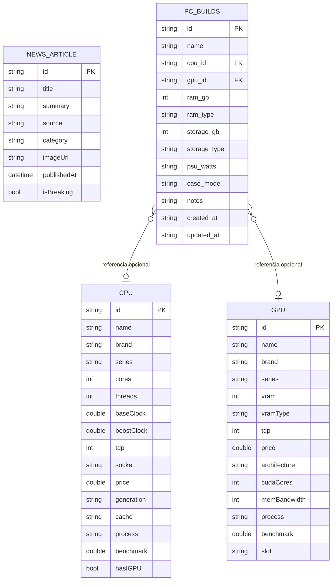

# Diagrama ER y Diccionario de Datos — Hardware Vault

La aplicación maneja dos clases de datos:

1. **Datos de catálogo (read-only):** CPUs, GPUs y NewsArticles definidos en código (`lib/data/mock_data.dart`).
2. **Datos persistidos (CRUD):** PCBuilds del usuario almacenados en SQLite local (`hardware_vault.db`).

## Diagrama ER



> Las relaciones `cpu_id` y `gpu_id` no son foreign keys reales en SQLite porque CPU/GPU viven en código (no en una tabla). Son referencias lógicas — se resuelven en `AppState.getCpuById()` y `getGpuById()`.

## Diccionario de Datos — Tabla `pc_builds` (SQLite)

DDL aplicado por `DatabaseHelper._open()`:

```sql
CREATE TABLE pc_builds (
  id            TEXT PRIMARY KEY,
  name          TEXT NOT NULL,
  cpu_id        TEXT,
  gpu_id        TEXT,
  ram_gb        INTEGER NOT NULL DEFAULT 16,
  ram_type      TEXT NOT NULL DEFAULT 'DDR5',
  storage_gb    INTEGER NOT NULL DEFAULT 1000,
  storage_type  TEXT NOT NULL DEFAULT 'NVMe SSD',
  psu_watts     TEXT,
  case_model    TEXT,
  notes         TEXT NOT NULL DEFAULT '',
  created_at    TEXT NOT NULL,
  updated_at    TEXT NOT NULL
);
```

| Columna | Tipo | Nulo | Default | Descripción |
|---|---|---|---|---|
| `id` | TEXT | No | — | Clave primaria. Generada como `build_<millisecondsSinceEpoch>` al crear. |
| `name` | TEXT | No | — | Nombre dado por el usuario (ej. "Gaming Rig 2025"). |
| `cpu_id` | TEXT | Sí | — | Referencia lógica al `CPU.id` del catálogo (`mock_data.dart`). |
| `gpu_id` | TEXT | Sí | — | Referencia lógica al `GPU.id` del catálogo. |
| `ram_gb` | INTEGER | No | 16 | Capacidad RAM en GB (8, 16, 32, 64, 128). |
| `ram_type` | TEXT | No | 'DDR5' | Tipo de RAM (DDR4 / DDR5). |
| `storage_gb` | INTEGER | No | 1000 | Capacidad de almacenamiento en GB (256–4000). |
| `storage_type` | TEXT | No | 'NVMe SSD' | NVMe SSD, SATA SSD o HDD. |
| `psu_watts` | TEXT | Sí | — | Capacidad de la fuente (texto libre, opcional). |
| `case_model` | TEXT | Sí | — | Modelo del gabinete (texto libre, opcional). |
| `notes` | TEXT | No | '' | Notas libres del usuario. |
| `created_at` | TEXT | No | — | ISO-8601 (`DateTime.toIso8601String()`). |
| `updated_at` | TEXT | No | — | ISO-8601. Se actualiza en cada save. |

## Diccionario de Datos — Catálogo en código

### `CPU` ([lib/models/models.dart](../../lib/models/models.dart))

| Campo | Tipo | Descripción |
|---|---|---|
| `id` | String | Identificador único (ej. `i_cu9_285k`). |
| `name` | String | Nombre comercial (ej. "Core Ultra 9 285K"). |
| `brand` | String | "Intel" o "AMD". |
| `series` | String | Línea/familia (ej. "Core Ultra 200"). |
| `cores` | int | Núcleos físicos. |
| `threads` | int | Hilos lógicos. |
| `baseClock` | double | Frecuencia base en GHz. |
| `boostClock` | double | Frecuencia turbo en GHz. |
| `tdp` | int | TDP en watts. |
| `socket` | String | Socket compatible (LGA1851, AM5, etc.). |
| `price` | double | Precio MSRP en USD. |
| `generation` | String | Codename (Arrow Lake, Granite Ridge, etc.). |
| `cache` | String | Tamaño y tipo de caché L3. |
| `process` | String | Nodo de fabricación. |
| `benchmark` | double | Score relativo (0–100). |
| `hasIGPU` | bool | Tiene gráficos integrados. |

### `GPU` ([lib/models/models.dart](../../lib/models/models.dart))

| Campo | Tipo | Descripción |
|---|---|---|
| `id` | String | Identificador único (ej. `n_5090`). |
| `name` | String | Nombre comercial (ej. "GeForce RTX 5090"). |
| `brand` | String | "Nvidia", "AMD" o "Intel". |
| `series` | String | Línea (RTX 5000, RX 9000, Arc B, etc.). |
| `vram` | int | VRAM en GB. |
| `vramType` | String | GDDR6, GDDR6X, GDDR7. |
| `tdp` | int | TDP en watts. |
| `price` | double | Precio MSRP en USD. |
| `architecture` | String | Codename (Blackwell, RDNA 4, Battlemage, etc.). |
| `cudaCores` | int | Shader processors. |
| `memBandwidth` | int | Ancho de banda en GB/s. |
| `process` | String | Nodo de fabricación. |
| `benchmark` | double | Score relativo (0–100). |
| `slot` | String | Tamaño físico (2-slot, 2.5-slot, 3-slot). |

### `NewsArticle` ([lib/models/models.dart](../../lib/models/models.dart))

| Campo | Tipo | Descripción |
|---|---|---|
| `id` | String | Identificador único. |
| `title` | String | Título del artículo. |
| `summary` | String | Resumen (2–3 oraciones). |
| `source` | String | Medio (TechPowerUp, AnandTech, etc.). |
| `category` | String | GPU, CPU, Memory, Event. |
| `imageUrl` | String | URL Unsplash temática. |
| `publishedAt` | DateTime | Fecha relativa (renderizada con `timeago`). |
| `isBreaking` | bool | Marca de noticia destacada. |
