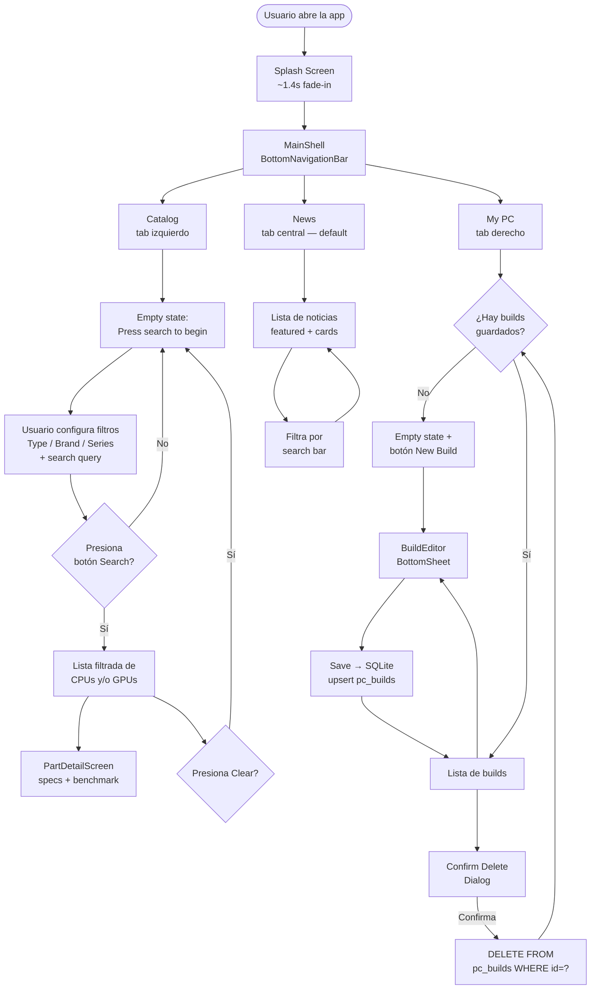

# Diagrama de Flujo Funcional — Hardware Vault

Representa el recorrido principal del usuario al utilizar la aplicación.

**Notas funcionales clave:**

- El catálogo arranca en estado vacío y solo muestra resultados al presionar Search (botón verde) o Enter en el TextField.
- El botón Clear (X) solo aparece cuando hay algún filtro activo o texto en la búsqueda.
- News carga 8 artículos mock con imágenes temáticas de Unsplash.
- My PC persiste cada build en una tabla SQLite (`pc_builds`) usando `sqflite`.
